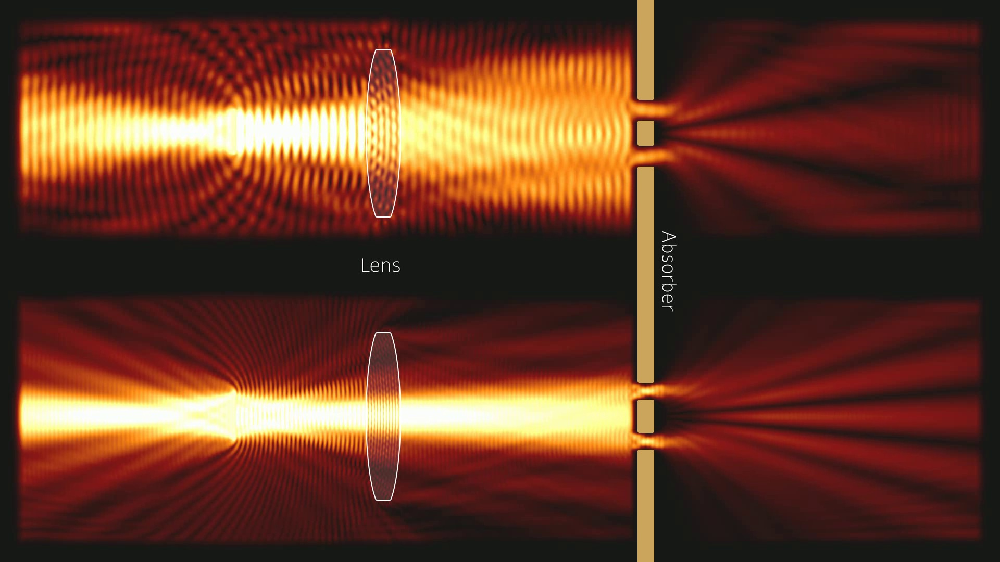
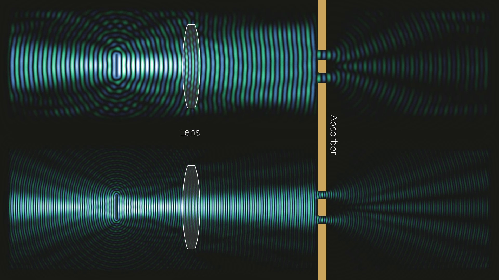
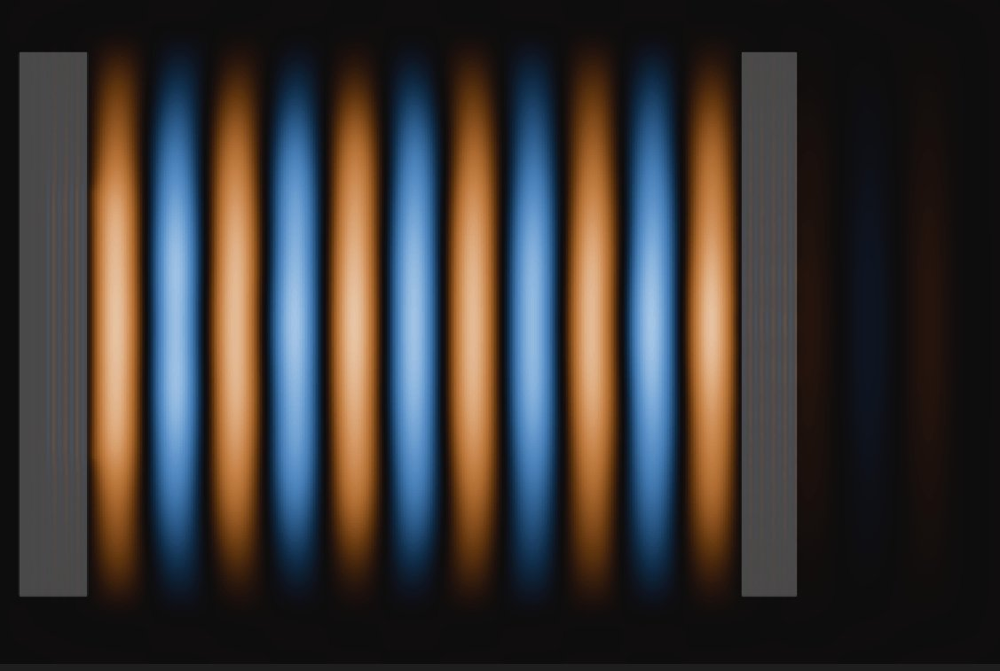
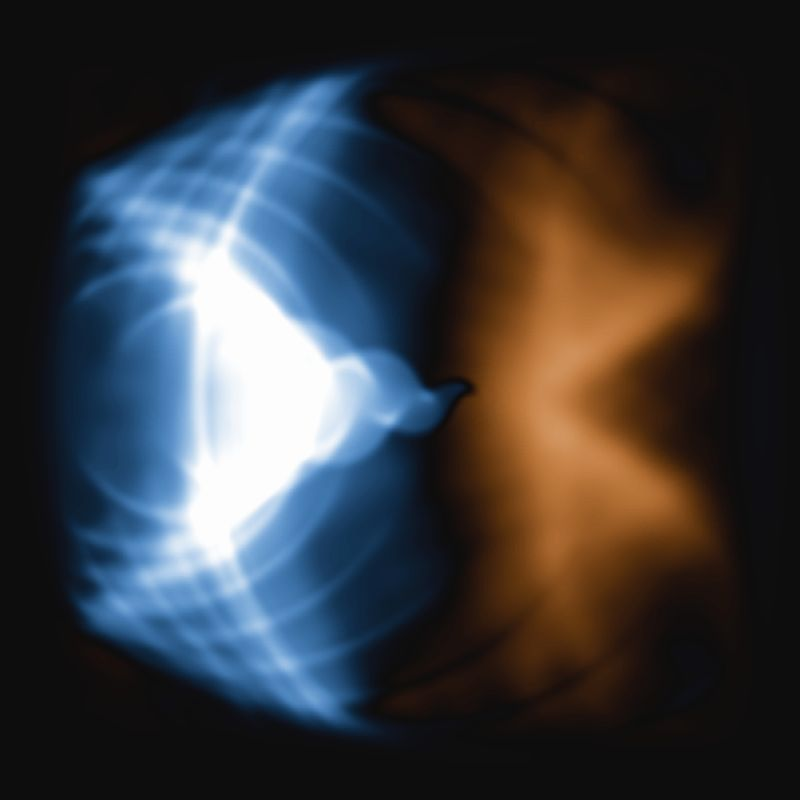
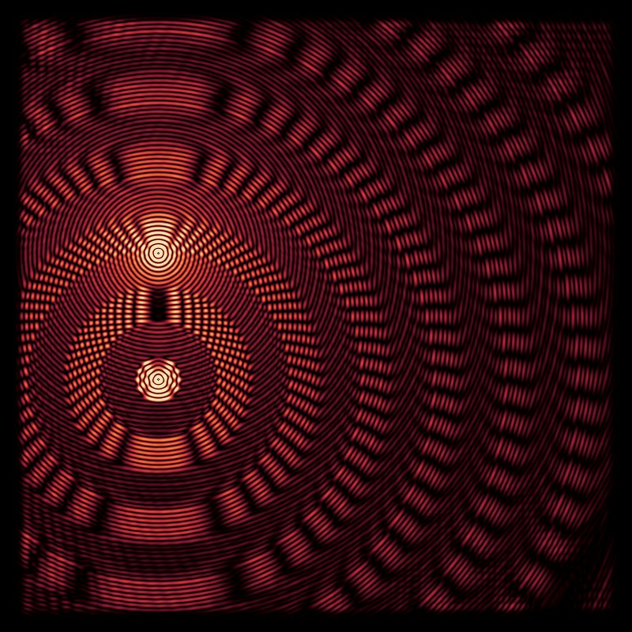
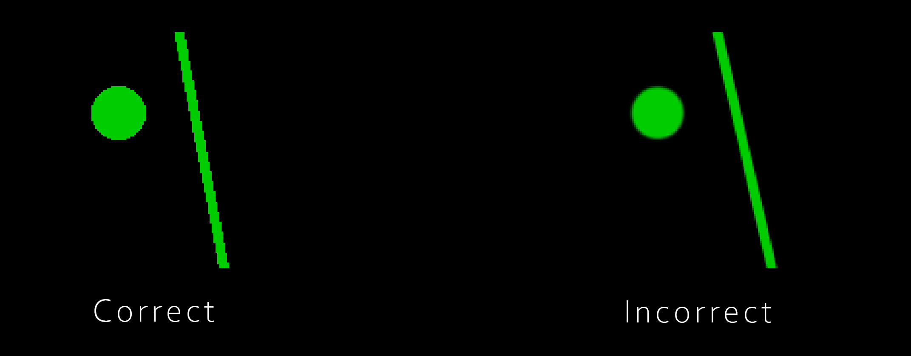

# 2D Wave Simulation on the GPU

This repository contains a lightweight 2D wave simulator running on the GPU using CuPy library (probably requires a NVIDIA GPU). It can be used for 2D light and sound simulations.
A simple visualizer shows the field and its intensity on the screen and writes a movie file for each to disks. The goal is to provide a fast, easy to use but still felxible wave simulator.

    
    

### Update 06.04.2025

* Scene objects can now draw to a visualization layer (most of them do not yet, feel free to contribute) !
* Example 4 now shows a two-mirror optical cavity and how standing waves emerge.
* Added new Line Sources
* Added Refractive index Polygon object (StaticRefractiveIndexPolygon)
* Added Refractive index Box object (StaticRefractiveIndexBox)
* Fixed some issues with the examples

    

### Update 01.04.2024

* Refactored the code to support a more flexible scene description. A simulation scene now consists of a list of objects that add their contribution to the fields.
They can be combined to build complex and time dependent simulations. The refactoring also made the core simulation code even simpler.
* Added a few new custom colormaps that work well for wave simulations.
* Added new examples, which should make it easier to understand the usage of the program and how you can setup your own simulations: [examples](source/examples).

    
    

The old image based scene description is still available as a scene object. You can continue to use the convenience of an image editing software and create simulations
without much programming.

###  Image Scene Decsription Usage ###

When using the 'StaticImageScene' class the simulation scenes can given as an 8Bit RGB image with the following channel semantics:
* Red:   The Refractive index times 100 (for refractive index 1.5 you would use value 150)
* Green: Each pixel with a green value above 0 is a sinusoidal wave source. The green value defines its frequency.
* Blue:  Absorbtion field. Larger values correspond to higher dampening of the waves, use graduated transitions to avoid reflections

WARNING: Do not use anti-aliasing for the green channel ! The shades produced are interpreted as different source frequencies, which yields weird results.

    

### Recommended Installation ###

1. Install Python and PyCharm IDE
2. Clone the Project to you hard disk
3. Open the folder as a Project using PyCharm
4. If prompted to install requirements, accept (or install requirements using pip -r requirements.txt)
5. Right click on one of the examples in wave_sim2d/examples and select run

NOTE: If you have issues installing the `cupy` library
1. Make sure you have the `nvidia-cuda-toolkit` installed. 
You can check it by running `nvcc --version`.
1. In the *requirements.txt* file, replace `cupy` by `cupy-cuda[version-number]x`. 
   Where the version number displayed when running `nvcc --version` (example: `cupy-cuda11x`).

