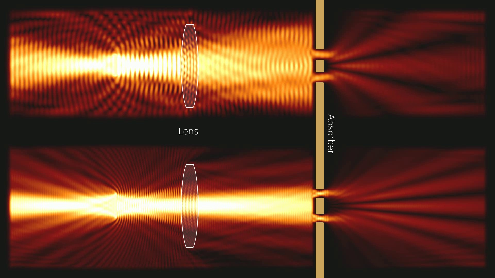
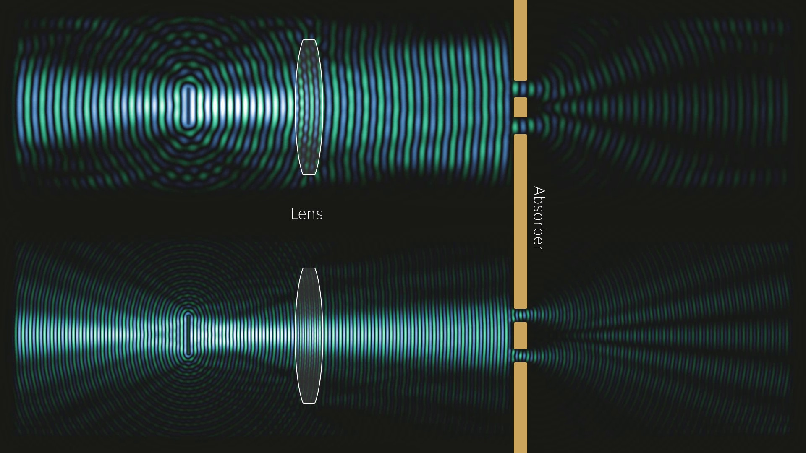

# 2D Wave Simulation on the GPU

This repository contains a lightweight 2D wave simulator running on the GPU using CuPy library (probably requires a NVIDIA GPU). It can be used for 2D light and sound simulations.
A simple visualizer shows the field and its intensity on the screen and writes a movie file for each to disks. 

    
    

### Usage ###

The simulation scenes are given as an 8Bit RGB image with the following channel semantics:
* Red:   The Refractive index times 100 (for refractive index 1.5 you would use value 150)
* Green: Each pixel with a green value above 0 is a sinusoidal wave source. The green value defines its frequency.
* Blue:  Absorbtion field. Larger values correspond to higher dampening of the waves, use graduated transitions to avoid reflections

WARNING: Do not use anti aliasing for the green channel ! The shades produced are interpreted as different source frequency which yields weird results.

### Recommended Installation ###

1. Go [here](https://github.com/conda-forge/miniforge) and install miniforge/mamba, which is a python package manager.
2. Start the mamba command prompt (under windows type 'Miniforge Prompt' in the start menu and you should find it).
3. install the dependencies by running:
   - **mamba install numpy, opencv, matplotlib, cupy**
4. Run the program directly from the miniforge prompt (cd into the directory where you downloaded the Wave Simulator first):
   python main.py
6. Alternatively, you can run the program from an IDE like PyCharm (don't forget to configure the IDE to use the python interpreter from the mamba/miniforge install directory)

